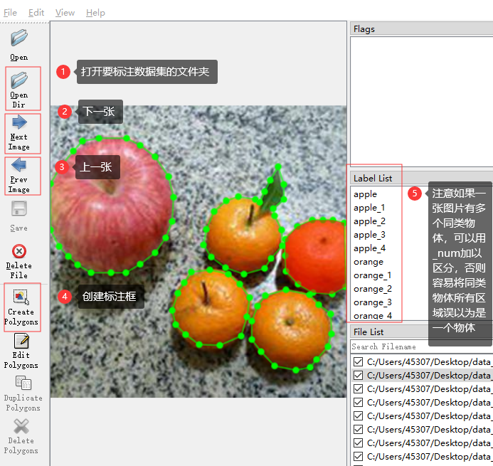
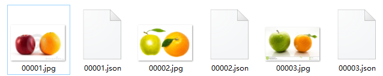
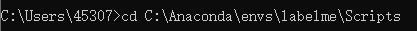
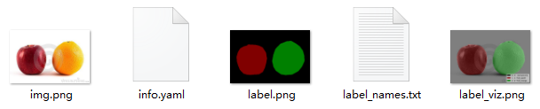
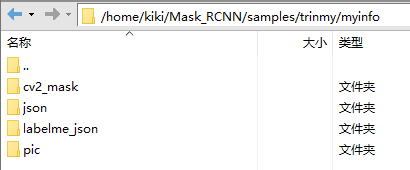
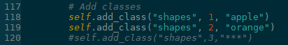
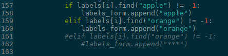
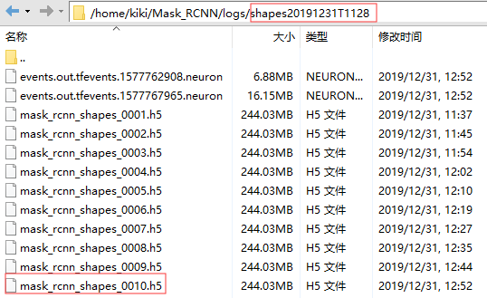
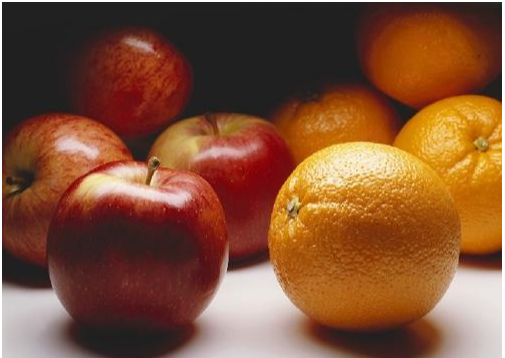

# 用mask_rcnn训练自己的数据集

## 1、 数据标注

我这里使用的是win10上的labelme，大家也可使用其它工具进行标注。

labelme安装与使用方法如下：

需要有**Anaconda**，我的是Python3.6版本，打开**Anaconda Prompt**，依次输入以下命令

```
#创建虚拟环境
#这里在虚拟环境里安装打开标注工具labelme，一个是防止包的版本与现有版本冲突，一个是保持环境纯净性
conda create --name=labelme python=3.6

#进入此环境
activate labelme

#安装一些依赖包
conda install pyqt5
#或者pip install pyqt5 -i http://pypi.douban.com/simple/ --trusted-host pypi.douban.com
pip install labelme	#安装后里面有pillow

conda install pillow=4.0.0
```

以上都成功后，在**Anaconda Prompt**中输入labelme，打开下图所示页面，即可进行数据标注

> 注：如果是关闭后再次打开，直接在**Anaconda Prompt**中输入activate labelme，进入虚拟环境，然后输入labelme即可进行再次标注



点击左侧的Open Dir打开要标注的文件夹，然后点击Create Polygons进行图像标注，标注完成后，会将结果保存成.json格式，结果如下



## 2、 数据格式转换

### 2.1数据格式

```
train_data
  ├── pic	#存放原始图片
  ├── json	#存放labelme标注后的json文件
  ├── labelme_json	#存放json_to_dataset生成的文件夹，下面会介绍如何生成
  └── cv2_mask	存放转换后的mask图像，下面会介绍如何生成
```

### 2.2数据转换

- pic&json

这两个文件已经存在，pic是原始图片，json是经过labelme标注后的json文件

- labelme_json

打开labelme安装目录，找到C:/Anaconda/envs/labelme/Lib/site-packages/labelme/cli（各位大大的路径可能不完全相同）路径下的json_to_dataset.py，内容替换成本项目中的json_to_dataset.py（主要是加一个for循环，不用一个个转换）

替换结束后，打开cmd，切换到**labelme_json_to_dataset.exe**目录下，该文件在Anaconda的Scripts的目录下



然后执行

```
labelme_json_to_dataset.exe C:\Users\45307\Desktop\data_annocated\datasets_coco\json
```

其中C:\Users\\...\json是json文件所在路径

执行完成后会在当前目录**C:\Anaconda\envs\labelme\Scripts**中生成多个文件夹，每个文件夹里包含以下5个文件，将产生的所有文件夹剪切至labelme_json文件夹中



- cv2_mask

主要存放labelme_json中每个子文件夹中的label.png，且图片命名对应原图像名称

具体做法为：

在pic、json、labelme_json三个文件夹的同级目录下新建一个空文件夹，命名为cv2_mask；

创建一个cv2_mask.py文件，运行此脚本，完成cv2_mask文件夹创建

## 3、 模型训练

代码参考的是大神的https://github.com/matterport/Mask_RCNN

首先git clone一下，然后在根目录下创建一个train.py，再下载一个初始参数mask_rcnn_coco.h5文件，下载链接：https://pan.baidu.com/s/1GaP0R24sX-iM-_AeEOS_KA   提取码：ko81

### 3.1代码修改

要训练自己的数据集的话，train.py必须要改的几个地方

（1）NUM_CLASSES

在代码的50行，要分割的类别数，改成自己的类别数

```
NUM_CLASSES = 2 + 1 #这里2是自己的类别数（如我这是苹果、橘子2类），+1指背景类
```

（2）dataset_root_path

在代码的173行，数据集路径，修改成自己存放第二步中cv2_mask那4个文件夹（记得在此之前将那4个文件夹转移到此项目中）

```
dataset_root_path = "samples/trinmy/myinfo/"
```



（3）add_class

在代码的118行和155-160行，添加标注的类别名称，修改成自己数据集的类别名称





执行```python3 train.py```即可进行模型训练

### 3.2避坑指南

**踩坑1**：报错--tensorflow.python.framework.errors_impl.InternalError: Failed to create session.

原因：out of GPU memory

解决：在运行train.py前，先执行以下代码

```
export CUDA_VISIBLE_DEVICES=''
```

**踩坑2**：报错--YAMLLoadWarning: calling yaml.load() without Loader=... is deprecated, as the default Loa

原因：yaml5.1版本后因为安全问题弃用了yaml.load(file)这个用法，需要指定Loader

解决：修改train.py中84行的yaml.load用法（本代码中已改）

**踩坑3**：ModuleNotFoundError: No module named '_tkinter'

解决：修改train.py中的

```
import matplotlib
matplotlib.use('Agg')	#添加，不过如此一来，后面的测试结果也将不在xmanager中展示
import matplotlib.pyplot as plt
```

**踩坑4**：AttributeError: module 'tensorflow.python.keras.backend' has no attribute 'get_graph'

原因： 安装的tensorflow版本和keras版本不匹配 

解决： 重新安装自己tensorflow对应的版本就OK了 

 查看tensorflow和keras对应的版本：https://docs.floydhub.com/guides/environments/ 

踩坑5：运行train.py时AttributeError: module 'yaml' has no attribute 'FullLoader'

解决：

```
pip install --ignore-installed PyYAML
```


## 4、 模型测试

在根目录创建一个fortest.py

训练自己的数据集的话需要修改以下几个地方

（1）NUM_CLASSES

在代码的50行，要分割的类别数，改成自己的类别数

```
NUM_CLASSES = 2 + 1 #这里2是自己的类别数（如我这是苹果、橘子2类），+1指背景类
```

（2）COCO_MODEL_PATH

在代码的29行，模型训练所得的权重路径，改成自己上步训练所得的权重路径，在logs文件夹底下



```
COCO_MODEL_PATH = os.path.join(MODEL_DIR,"shapes20191231T1128/mask_rcnn_shapes_0010.h5")
```

（3）class_names

在代码的85行，类别名称，修改成自己的数据集类别

```
class_names = ['BG', 'apple','orange']	#其中BG是background背景类
```

（4）image

在代码的88行，要测试图片的路径及名称，修改成自己要测试图片的信息（测试前，记得上传图片到该文件夹下）

```
image = skimage.io.imread("./images/apple_orange_test_001.jpg") 
```

执行```python3 fortest.py```，在Xmanager6展示结果如下右图，左图是测试原图




## 参考资料

https://blog.csdn.net/doudou_here/article/details/87855273

http://www.freesion.com/article/451581428/

https://blog.csdn.net/weixin_42882838/article/details/102843082

https://blog.csdn.net/shuiyixin/article/details/90486009
